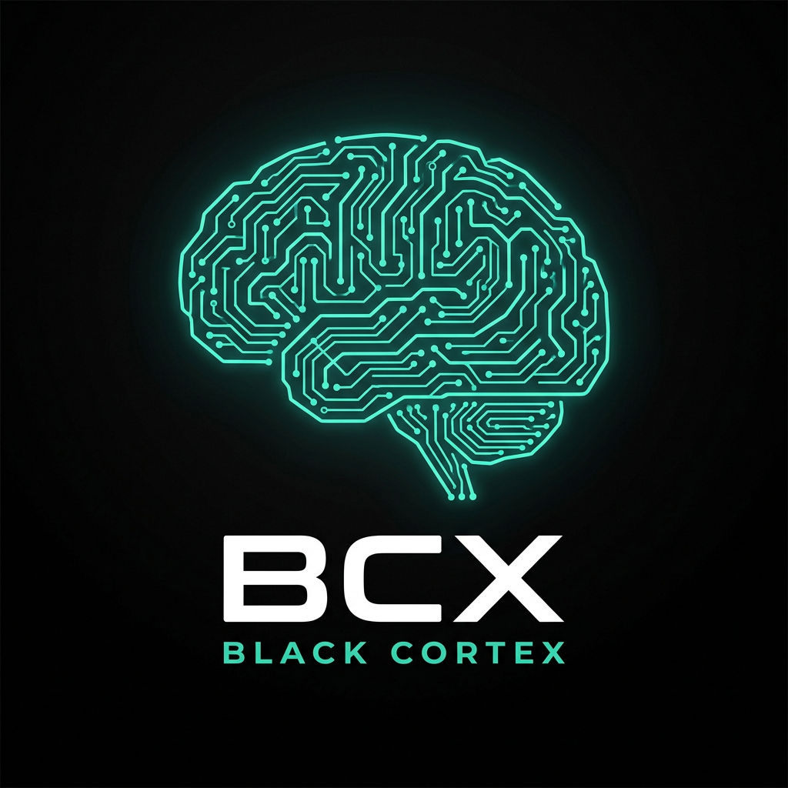
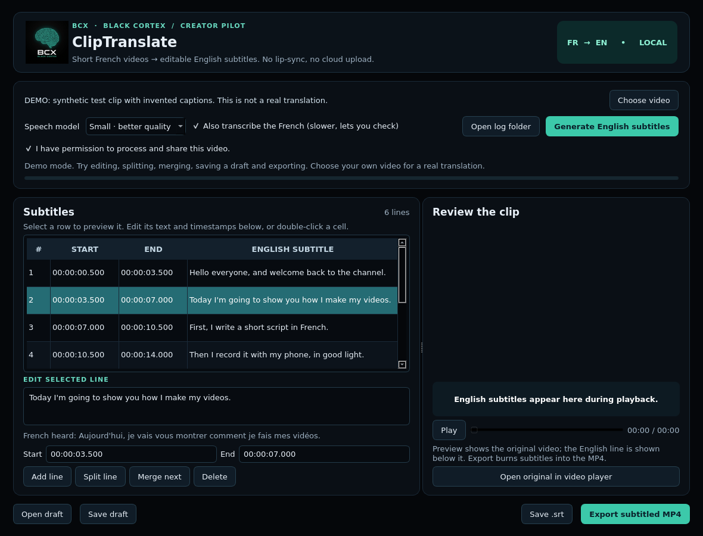

# BCX ClipTranslate: get it and run it (step by step)





*Demo mode: invented captions on a synthetic clip. The video pane is empty in this screenshot only because it was taken on a server without video playback. On your computer the clip plays there.*

**Time needed:** about 15 minutes the first time. **You need:** a Windows, macOS or Linux computer with a screen, an internet connection, and about 1 GB of free disk space.

---

## Step 1. Install three free programs (skip any you already have)

| Program | Why | Where |
| --- | --- | --- |
| **Python 3.12** (3.10 or 3.11 also work, **not 3.13**) | Runs the app | https://www.python.org/downloads/ . **On Windows, tick "Add python.exe to PATH" on the first installer screen.** |
| **Git** | Downloads the project | https://git-scm.com/downloads |
| **VS Code** | Where you run it | https://code.visualstudio.com/ . Open it, then install the **Python** extension when it offers. |

Check Python: open a terminal (Windows: search "PowerShell"; macOS: "Terminal") and type `python --version` (on Windows if that fails, try `py --version`). It must say 3.10, 3.11 or 3.12.

---

## Step 2. Download the project

### Option A: with Git (recommended)

In the terminal, go to the folder where you keep projects, then run:

```bash
git clone -b arena/01a0ecbd-video-translation https://github.com/fongangchrisp-cell/-Video-Translation.git bcx-cliptranslate
cd bcx-cliptranslate
code .
```

- The repository is public, so no login is needed to download it.
- `-b arena/01a0ecbd-video-translation` is required for now: the working app lives on that branch, not on `main`. (Once the branch is merged into `main` this flag is no longer needed.)
- `bcx-cliptranslate` is just the folder name. It avoids problems with the repository's real name, which starts with a hyphen.
- `code .` opens the folder in VS Code. If it says `code` is not found, open VS Code and use **File → Open Folder**.

### Option B: no Git, just a ZIP

1. Open https://github.com/fongangchrisp-cell/-Video-Translation/tree/arena/01a0ecbd-video-translation
2. Click the green **Code** button → **Download ZIP**, then unzip it.
3. In VS Code: **File → Open Folder** and choose the unzipped folder.

### Option C: GitHub Desktop

Install https://desktop.github.com/, choose **File → Clone repository → URL**, paste `https://github.com/fongangchrisp-cell/-Video-Translation`, then switch to the branch `arena/01a0ecbd-video-translation`.

---

## Step 3. Set up (once)

In VS Code open the terminal: **Terminal → New Terminal**. Make sure it shows the project folder.

**Windows (PowerShell):**
```powershell
py -3.12 -m venv .venv
.venv\Scripts\Activate.ps1
python -m pip install -e ".[dev]"
```
Use `py -3.11` if you installed 3.11. If PowerShell refuses to run the activation script, run this once and try again:
`Set-ExecutionPolicy -Scope CurrentUser RemoteSigned`

**macOS / Linux:**
```bash
python3 -m venv .venv
source .venv/bin/activate
python -m pip install -e ".[dev]"
```

The last command downloads the libraries (several hundred MB; a few minutes). When the prompt returns with no red error, it worked. Then press **Ctrl+Shift+P** (Cmd+Shift+P on macOS), type **Python: Select Interpreter**, and choose the one inside `.venv`.

---

## Step 4. Run the demo

Open **Run and Debug** (the play-with-bug icon on the left, or Ctrl+Shift+D). At the top choose **ClipTranslate DEMO (sample clip, no model download)** and press **F5**.

Or type in the terminal: `python -m cliptranslate --demo`

A black window with the BCX logo opens, with six invented subtitle lines. **No translation model is used in demo mode.** Try these:

1. Click a line. The **French heard** text appears under the editor.
2. Edit the English text; change a time; click **Split line** and **Merge next**.
3. Click **Save .srt** to write a subtitle file, and **Export subtitled MP4** to burn the captions into the sample clip. This uses the real video export.
4. Close the window. If you changed anything, it asks whether to save a draft.

---

## Step 5. Try the real translation (the test that matters)

1. Choose **ClipTranslate (real: choose your own video)** in Run and Debug, or run `python -m cliptranslate`.
2. Click **Choose video** and pick a **30 to 90 second clip of someone speaking clear French**, such as you or a friend. Use only video you have the right to use. MP4, MOV or MKV, with sound.
3. Tick the permission box. Keep **Small** and **Also transcribe the French** on. Click **Generate English subtitles**.
4. **The first time it downloads the speech model (several hundred MB) and the bar moves slowly.** A laptop may take several minutes per clip. **Cancel job** stops it safely.
5. Compare each English line with **French heard**. Fix errors. **Count how many lines you fixed and how many minutes it took.**
6. Export the MP4 and watch it.

### Send the team this report (it is the most valuable thing you can do for BCX right now)

- Your computer: Windows/macOS/Linux and the version, RAM, and whether it has a graphics card.
- Clip length, the model used, and how long generating took.
- What the English got wrong (examples), and lines you fixed.
- What you thought of the exported video.
- The log file: click **Open log folder** in the app and send `cliptranslate.log`. It holds timings and errors, **never the subtitle text**.

---

## If something goes wrong

| Problem | What to do |
| --- | --- |
| `python` is not recognised | Reinstall Python and tick **Add to PATH**, or use `py` on Windows. Open a **new** terminal afterwards. |
| `git` is not recognised | Install Git, then open a **new** terminal. Or use Option B. |
| `No module named PySide6` or `cliptranslate` | The environment is not active or Step 3 failed. Run Step 3 again in the VS Code terminal and select the interpreter. |
| Install fails on Python 3.13 | Install Python 3.12 and recreate `.venv`. |
| Window opens but video won't play | Your system lacks a codec for that file. Click **Open original in video player**. Subtitles and export still work. |
| **Could not load the speech model** | No internet, no disk space, or a network blocking the model download. Try another network. |
| Export says FFmpeg lacks `subtitles/libass` | Save the `.srt`. Tell the team your operating system; this is exactly what we need to learn. |
| Linux: Qt error mentioning `xcb` | `sudo apt install libxcb-cursor0 libgl1 libegl1 libxkbcommon0` |
| `cd -Video-Translation` fails | Use the folder name from Option A (`bcx-cliptranslate`), or `cd ./-Video-Translation`. |

## What this is and is not

A **working prototype**, not a product. Real translation quality has not been measured, Windows and macOS are unverified, and there is no installer. Always check subtitles before sharing a video.

More: [VISION.md](VISION.md) (where BCX is going) · [PILOT.md](PILOT.md) · [AUDIT.md](AUDIT.md) · [WORKPLAN.md](WORKPLAN.md) · [README.md](README.md)
